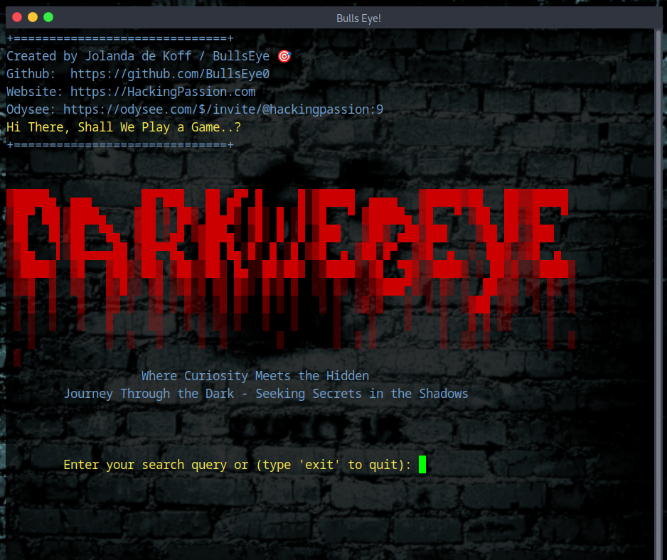
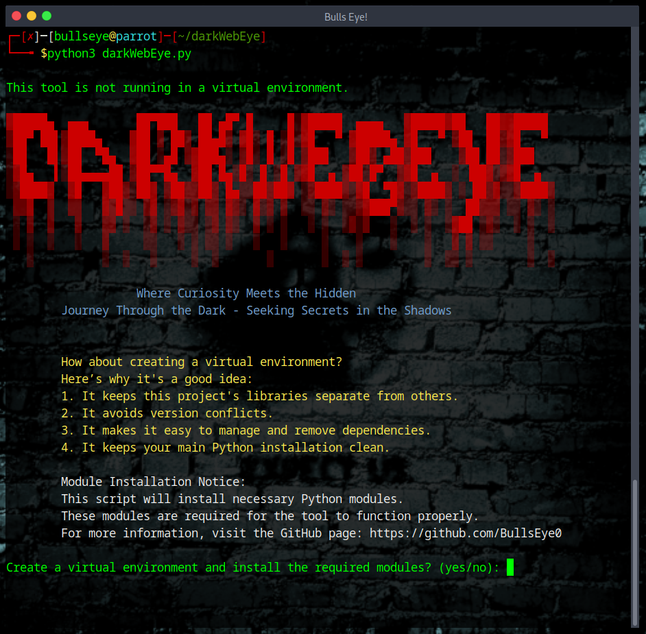
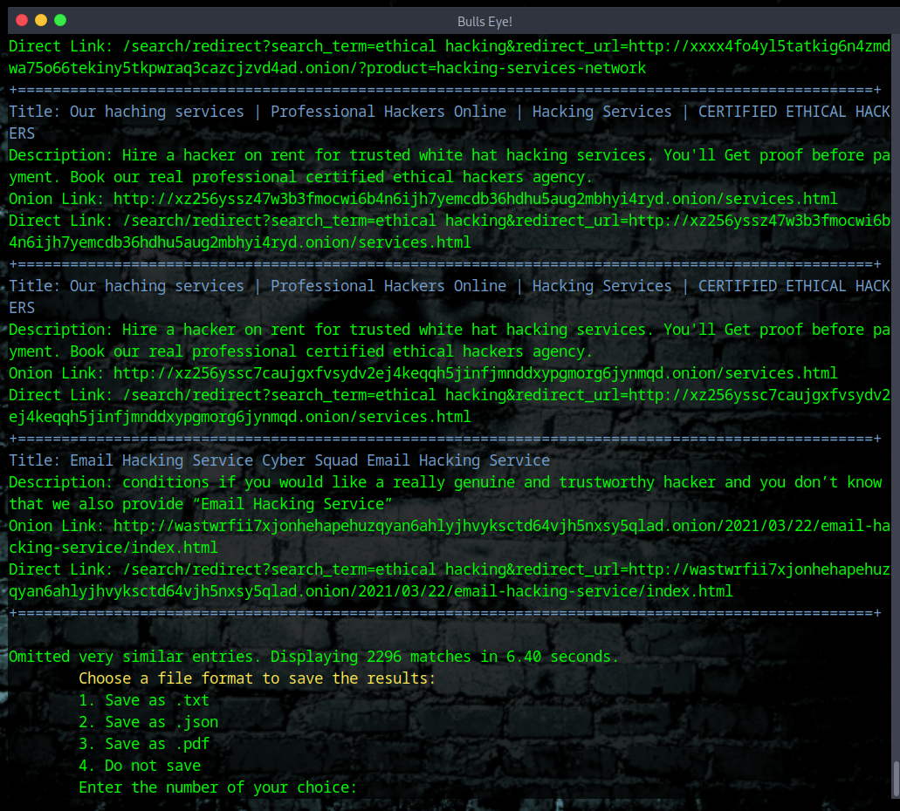
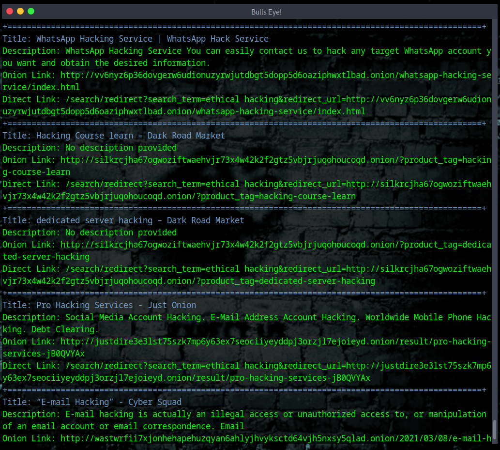

# DarkWebEye
Welcome to DarkWebEye. Explore the unseen depths of the internet with DarkWebEye, a powerful and intuitive tool crafted by Jolanda de Koff. Designed for ethical hackers, cybersecurity enthusiasts, and researchers, DarkWebEye offers a secure and efficient way to search the dark web through the Ahmia search engine. 

***Your Gateway to the Hidden Web***



[Here you can read the article on HackingPassion.com]

# DarkWebEye: 

> ### Where Curiosity Meets the Hidden - Journey Through the Dark - Seeking Secrets in the Shadows

## Introduction
Welcome to DarkWebEye. This tool, crafted by me, Jolanda de Koff, is designed to help you explore the hidden parts of the web safely and efficiently. DarkWebEye uses the Ahmia search engine to provide a streamlined way to find specific content on the dark web. It's perfect for cybersecurity enthusiasts, ethical hackers, and researchers.

Why DarkWebEye?
The dark web is a mysterious and often misunderstood part of the internet. With DarkWebEye, you can navigate this complex landscape responsibly. Whether you want to understand hidden services, gather research data, or satisfy your curiosity, DarkWebEye is your reliable guide.


## Key Features

- **Easy Setup:** Quickly get started with a virtual environment that installs all the necessary Python modules.
- **Custom Search Filters:** Tailor your search by time frame to get the most relevant results.
- **Multiple Output Formats:** Save your search results in TXT, JSON, or PDF format for easy reference.
- **User-Friendly Interface:** Navigate through the dark web with a simple and intuitive command-line interface.

## How It Works

DarkWebEye begins by ensuring you have all the required modules installed in a virtual environment. If not, it guides you through the setup process. Once everything is in place, you can enter your search query and select a time filter (e.g., Any Time, Last Day, Last Week, Last Month). The results are displayed directly in your terminal, and you have the option to save them in your preferred format.


## Step-by-Step Guide

1. **Setup**:
    - Ensure you have Python 3 installed.
    - Clone or download the DarkWebEye script from [GitHub](https://github.com/BullsEye0/darkWebEye).

2. **Running the Script**:
    - Open your terminal.
    - Navigate to the folder containing the DarkWebEye script.
    - Execute the script by running `python darkWebEye.py`.

3. **Using DarkWebEye**:
    - Enter your search query when prompted.
    - Select the time filter for your search (e.g., Any Time, Last Day, Last Week, Last Month).
    - Review the search results directly in your terminal.
    - Choose a file format to save the results (TXT, JSON, or PDF) or opt not to save them.

4. **Saving Results**:
    - Specify the directory where you want to save the results.
    - DarkWebEye generates the file and stores it in your specified location.
  
Explore the dark web confidently and discover the hidden secrets waiting to be uncovered with DarkWebEye.

## Folder Structure

To keep everything organized, create a dedicated folder for DarkWebEye. This will house the script, virtual environment, and any search results. Here’s a simple structure you can follow:

```
/DarkWebEye
|-- /env # Virtual environment
|-- darkwebeye.py # The main script
|-- results #
```


### Steps to Run


1. Clone the Repository

```
git clone https://github.com/BullsEye0/darkWebEye.git && cd darkWebEye
```
2. Run the Script
```
python3 darkWebEye.py
``` 
*And that's it!*

## Follow Prompts

The tool will guide you through creating a **virtual environment** and installing the necessary modules.
Enter your search query and select a time filter.
Save Results

Choose a format to save the results for future reference.

## Safety Precautions
Before using darkWebEye, following some safety measures to protect your privacy and security is crucial.

- Use a VPN: Ensure you are connected to a reliable VPN to mask your IP address.
- Run in a Virtual Machine: Using a virtual machine can add an extra layer of security.
- Update Your Software: Keep all your software, including the Tor browser, up to date.
- Follow Good Practices: Do not share personal information and avoid clicking on suspicious links.
- For more detailed safety precautions, here on [Hackingpassion.com](https://hackingpassion.com) you can find more info.

## Video

[Here on Odysee, you can see the video: ](https://odysee.com/$/embed/@hackingpassion:9/darkWebEye:a?r=ATrtLheniwT9fg2d9GsyfTGaYUtpMfbK)


## About the Author

Hi there! I'm Jolanda de Koff, a passionate cybersecurity expert, Linux specialist, and ethical hacker. Over the years, I've dedicated myself to sharing knowledge and tools with the community through my websites, [HackingPassion.com](https://hackingpassion.com), [Bullseye0.com](https://bullseye0.com), and [JolandaDeKoff.com](https://jolandadekoff.com).

### My Mission

I believe that knowledge should be accessible to all. My goal is to educate and empower individuals to explore cybersecurity responsibly. Through my tutorials, I aim to demystify the complexities of ethical hacking and provide practical insights that you can apply in real-world scenarios.




## Stay Connected

I'm all about connecting with like-minded individuals and fostering a community of learning and growth. Here are some ways you can connect with me and stay updated:

Website: [HackingPassion.com](https://hackingpassion.com) and [Jolanda de Koff](https://jolandadekoff.com)

GitHub: [BullsEye0](https://github.com/BullsEye0)

Facebook Page: [Ethical Hack Group](https://www.facebook.com/ethical.hack.group)

Odysee: [Hacking Passion](https://odysee.com/$/invite/@hackingpassion:9)

Linkedin: [Linkedin](https://www.linkedin.com/in/jolandadekoff/)

> Join the journey through the shadows of the dark web with darkWebEye and discover the hidden secrets waiting to be uncovered.


